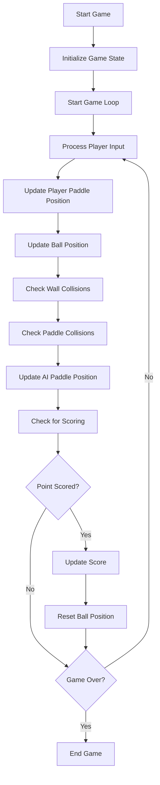

# Flutter Pong Clone

This project is a personal, educational recreation of Pong for the purpose of studying Flutter. All original assets, graphics, and game concepts are owned by their respective copyright holders. This project is not intended for commercial use and is strictly for educational purposes.

None of the original assets or codes from the game were used in this project. It was intended to recreate the game with the same retro-style look and feel, but the target was not the exact reproduction.

## Project Overview

The game features:
- Player-controlled paddle using arrow keys
- AI-controlled opponent paddle
- Increasing ball speed as the game progresses
- Retro-style pixelated score display
- Sound effects for ball collisions and scoring

The project is structured into three main Dart files:
1. `main.dart`: Sets up the Flutter app and defines the overall theme.
2. `pong_game.dart`: Contains the game logic, including paddle movement, ball physics, and scoring.
3. `pong_painter.dart`: Handles the custom rendering of game elements on the screen.

## Game Algorithm Flow



## Prerequisites

Before running this project, ensure you have the following installed:
- Flutter SDK (preferably the latest stable version)
- Dart SDK
- An IDE (e.g., Visual Studio Code, IntelliJ IDEA, or Android Studio)

For desktop development, you'll need:
- For macOS: Xcode
- For Windows: Visual Studio
- For Linux: Relevant libraries (check Flutter's Linux prerequisites)

## Setting Up the Project

1. Clone the repository:
   ```
   git clone https://github.com/figueiredoluiz/flutter-pong-clone.git
   ```

2. Navigate to the project directory:
   ```
   cd flutter-pong-clone
   ```

3. Get the dependencies:
   ```
   flutter pub get
   ```

4. Ensure you have desktop support enabled:
   ```
   flutter config --enable-windows-desktop
   flutter config --enable-macos-desktop
   flutter config --enable-linux-desktop
   ```
   (Run the command relevant to your operating system)

## Running the Game

To run the game on desktop:

1. For macOS:
   ```
   flutter run -d macos
   ```

2. For Windows:
   ```
   flutter run -d windows
   ```

3. For Linux:
   ```
   flutter run -d linux
   ```

Alternatively, you can run the project from your IDE if it supports Flutter development.

## Game Controls

- Use the Up Arrow key to move the paddle up
- Use the Down Arrow key to move the paddle down
- Press Enter to reset the game

## Project Structure

- `lib/`
  - `main.dart`: Entry point of the application
  - `pong_game.dart`: Core game logic
  - `pong_painter.dart`: Custom painter for rendering the game
- `assets/`: Contains sound effect files
  - `wall_sound.wav`
  - `paddle_sound.wav`
  - `point_sound.wav`
- `tests/`: Contains the unit tests
  - `main_test.dart`
  - `pong_game_test.dart`
  - `pong_painter_test.dart`

## Customization

You can customize various aspects of the game:
- Adjust ball speed, paddle size, or game dimensions in `pong_game.dart`
- Modify the appearance of game elements in `pong_painter.dart`
- Change sound effects by replacing the files in the `assets/` directory

## Known Limitations

- The game is designed for keyboard input and may not work well on touch devices.
- Web support may require additional adjustments for optimal performance.
